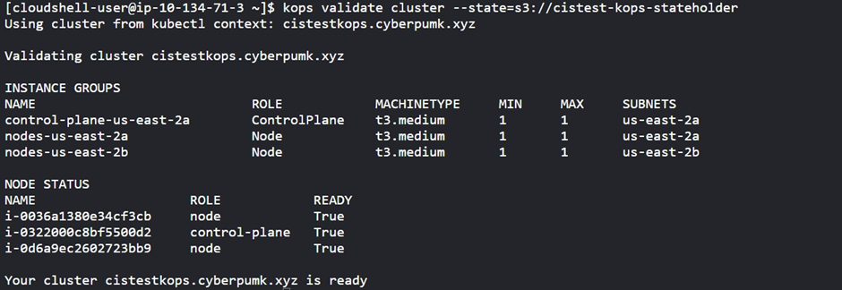
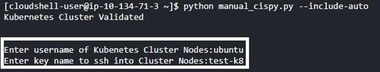
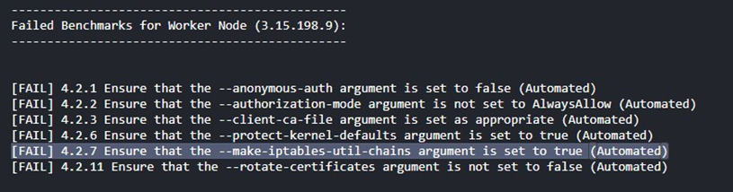
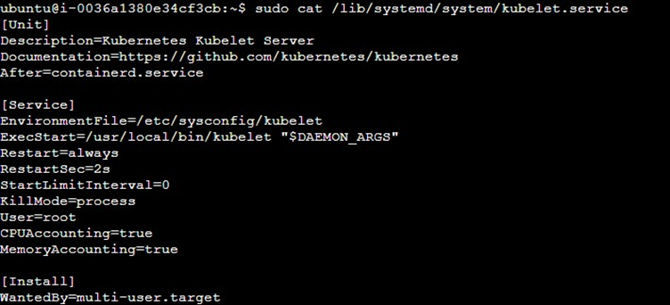
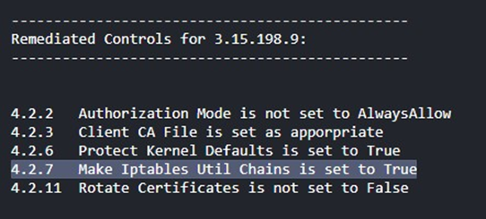
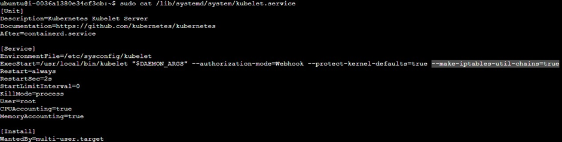
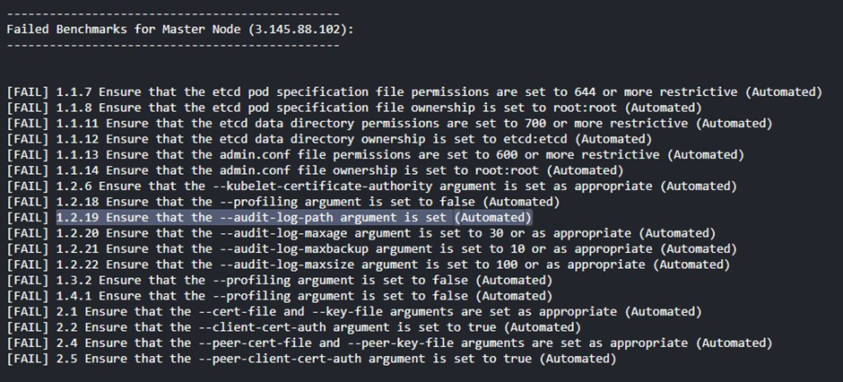
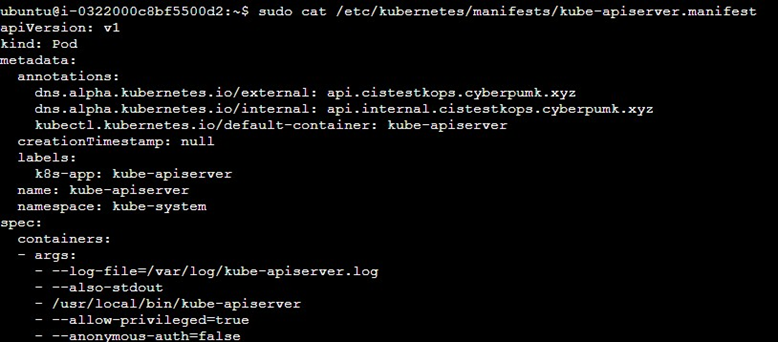
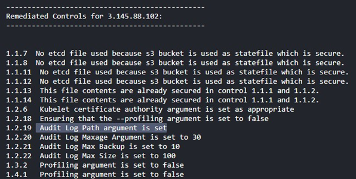
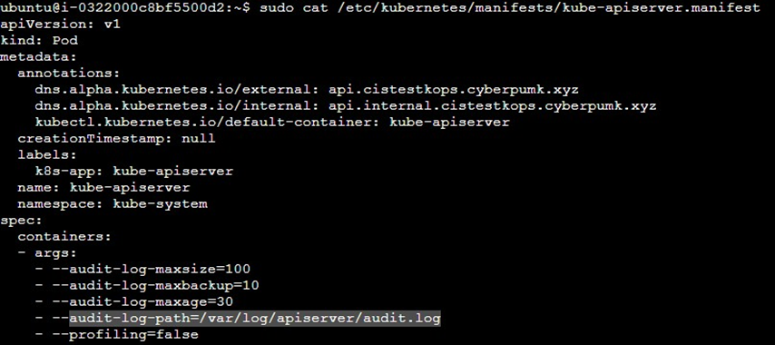

# Automatic-Hardening-of-K8S-Cluster-with-CIS-Benchmarks

## Securenetes

For automatic hardening of K8s cluster, but enforcing and implementing [CIS benchmark recommendations](https://www.cisecurity.org/benchmark/kubernetes).

## Table of Contents

 Click Me 

- [Solution Architecture](#solution-architecture)
  ![]
- [How to use?]()
- [ARCHITECTURE](#architecture)
- [ENVIRONMENT SETUP](#environment-setup)
- [REMEDIATED CONTROLS](#remediated-controls)
- [OUTPUT](#output)
- [EXAMPLES](#example-of-control-1219-before-remediation)
- [Limitations and known issues](#limitations-and-known-issues)

## How to use?

The python program ([main.py](./main.py)) supports use of the below three arguments:
  - `--include-auto`: To remediate all controls that can be done automatically
  - `--include-all`: To remediate all automated controls and provide steps to remediate controls that required manual intervention.
  - `--exempt`: To exclude certain controls from automatic remediation. Useful for production scenarios.

## ARCHITECTURE

## ENVIRONMENT SETUP

i) Install the pre-requisites:

- Kubectl – to interact with Kubernetes cluster from CLI.
- Kops - simplifies tasks related to cluster creation, configuration, and maintenance.

ii) Make sure to have the private key of nodes in particular directory so the tool can access them
while using paramiko client to SSH.

iii) Configure the CLI to assume the role with permissions to access the nodes if they were hosted
on cloud and assure that the state holder storages are accessible when buckets are used as
etcd storage.

iv) Validate the cluster from CLI to make sure that the cluster is ready and accessible.

## REMEDIATED CONTROLS

Below are the controls that can be remediated automatically on master node and the exact remediated
function is included in the source code.

| **Benchmark Controls**                                                                  | **Remediation Commands**                                                                                                                               |
| --------------------------------------------------------------------------------------- | ------------------------------------------------------------------------------------------------------------------------------------------------------ |
| 1.1.1 Ensure that the API server pod specification file permissions are set to 600.     | `sudo chmod 600 /etc/kubernetes/manifests/kube-apiserver.manifest`                                                                                     |
| 1.1.2 Ensure that the API server pod specification file ownership is set to root:root.  | `sudo chown root:root /etc/kubernetes/manifests/kube-apiserver.manifest`                                                                               |
| 1.1.3 Ensure that the controller manager pod specification file permissions are 600.    | `sudo chmod 600 /etc/kubernetes/manifests/kube-controller-manager.manifest`                                                                            |
| 1.1.4 Ensure that the controller manager pod specification file ownership is root:root. | `sudo chown root:root /etc/kubernetes/manifests/kube-controller-manager.manifest`                                                                      |
| 1.1.5 Ensure that the scheduler pod specification file permissions are 600.             | `sudo chmod 600 /etc/kubernetes/manifests/kube-scheduler.manifest`                                                                                     |
| 1.1.6 Ensure that the scheduler pod specification file ownership is root:root.          | `sudo chown root:root /etc/kubernetes/manifests/kube-scheduler.manifest`                                                                               |
| 1.1.19 Ensure that the Kubernetes PKI directory ownership is root:root.                 | `sudo chown -R root:root /etc/kubernetes/pki/`                                                                                                         |
| 1.2.2 Ensure the --token-auth-file parameter is not set.                                | Remove `--token-auth-file=<filename>` from `/etc/kubernetes/manifests/kube-apiserver.manifest`.                                                        |
| 1.2.4 Ensure --kubelet-https argument is set to true.                                   | Add `--kubelet-https=true` in `/etc/kubernetes/manifests/kube-apiserver.manifest`.                                                                     |
| 1.2.5 Ensure --kubelet-client-certificate and --kubelet-client-key arguments are set.   | Add `--kubelet-client-certificate=/srv/kubernetes/kube-apiserver/kubelet-api.crt --kubelet-client-key=/srv/kubernetes/kube-apiserver/kubelet-api.key`. |
| 1.2.6 Ensure --kubelet-certificate-authority argument is set.                           | Add `--kubelet-certificate-authority=/srv/kubernetes/ca.crt`.                                                                                          |
| 1.2.7 Ensure --authorization-mode argument is not AlwaysAllow.                          | Ensure `--authorization-mode=AlwaysAllow` is not present. Use values like `Node,RBAC`.                                                                 |
| 1.2.8 Ensure --authorization-mode argument includes Node.                               | Ensure `--authorization-mode=Node` is present.                                                                                                         |
| 1.2.9 Ensure --authorization-mode argument includes RBAC.                               | Ensure `--authorization-mode=RBAC` is present.                                                                                                         |
| 1.2.11 Ensure admission plugin AlwaysAdmit is not set.                                  | Remove `--enable-admission-plugins=AlwaysAdmit` or set other values.                                                                                   |
| 1.2.14 Ensure ServiceAccount plugin is set.                                             | Ensure `--disable-admission-plugins=ServiceAccount` is not present.                                                                                    |
| 1.2.15 Ensure NamespaceLifecycle plugin is set.                                         | Ensure `--disable-admission-plugins=NamespaceLifecycle` is not present.                                                                                |
| 1.2.16 Ensure NodeRestriction plugin is set.                                            | Ensure `--enable-admission-plugins=NodeRestriction` is present.                                                                                        |
| 1.2.17 Ensure --secure-port argument is non-zero.                                       | Ensure `--secure-port` is set to a non-zero value.                                                                                                     |
| 1.2.18 Ensure --profiling argument is false.                                            | Set `--profiling=false`.                                                                                                                               |
| 1.2.19 Ensure --audit-log-path argument is set.                                         | Add `--audit-log-path=/var/log/apiserver/audit.log`.                                                                                                   |
| 1.2.20 Ensure --audit-log-maxage argument is set.                                       | Add `--audit-log-maxage=30`.                                                                                                                           |
| 1.2.21 Ensure --audit-log-maxbackup argument is set.                                    | Add `--audit-log-maxbackup=10`.                                                                                                                        |
| 1.2.22 Ensure --audit-log-maxsize argument is set.                                      | Add `--audit-log-maxsize=100`.                                                                                                                         |
| 1.2.24 Ensure --service-account-lookup argument is true.                                | Add `--service-account-lookup=true`.                                                                                                                   |
| 1.2.25 Ensure --service-account-key-file argument is set.                               | Add `--service-account-key-file=/srv/kubernetes/kube-apiserver/service-account.pub`.                                                                   |
| 1.2.26 Ensure --etcd-certfile and --etcd-keyfile arguments are set.                     | Add `--etcd-certfile=/srv/kubernetes/kube-apiserver/etcd-client.crt --etcd-keyfile=/srv/kubernetes/kube-apiserver/etcd-client.key`.                    |
| 1.2.27 Ensure --tls-cert-file and --tls-private-key-file arguments are set.             | Add `--tls-cert-file=/srv/kubernetes/kube-apiserver/server.crt --tls-private-key-file=/srv/kubernetes/kube-apiserver/server.key`.                      |
| 1.2.28 Ensure --client-ca-file argument is set.                                         | Add `--client-ca-file=/srv/kubernetes/ca.crt`.                                                                                                         |
| 1.2.29 Ensure --etcd-cafile argument is set.                                            | Add `--etcd-cafile=/srv/kubernetes/kube-apiserver/etcd-ca.crt`.                                                                                        |
| 1.3.2 Ensure --profiling argument is false (controller).                                | Set `--profiling=false` in `/etc/kubernetes/manifests/kube-controller-manager.manifest`.                                                               |
| 1.3.3 Ensure --use-service-account-credentials argument is true.                        | Set `--use-service-account-credentials=true`.                                                                                                          |
| 1.3.4 Ensure --service-account-private-key-file argument is set.                        | Set `--service-account-private-key-file=/srv/kubernetes/kube-controller-manager/service-account.key`.                                                  |
| 1.3.5 Ensure --root-ca-file argument is set.                                            | Set `--root-ca-file=/srv/kubernetes/ca.crt`.                                                                                                           |
| 1.3.6 Ensure RotateKubeletServerCertificate argument is true.                           | Set `--feature-gates=RotateKubeletServerCertificate=true`.                                                                                             |
| 1.3.7 Ensure --bind-address argument is 127.0.0.1.                                      | Set `--bind-address=127.0.0.1`.                                                                                                                        |
| 1.4.1 Ensure --profiling argument is false (scheduler).                                 | Set `--profiling=false` in `/etc/kubernetes/manifests/kube-scheduler.manifest`.                                                                        |
| 1.4.2 Ensure --bind-address argument is 127.0.0.1.                                      | Set `--bind-address=127.0.0.1`.                                                                                                                        |
| 4.1.1 Ensure kubelet service file permissions are 600.                                  | `sudo chmod 600 /lib/systemd/system/kubelet.service`.                                                                                                  |
| 4.1.2 Ensure kubelet service file ownership is root:root.                               | `sudo chown root:root /lib/systemd/system/kubelet.service`.                                                                                            |
| 4.1.5 Ensure --kubeconfig permissions are 600.                                          | `sudo chmod 600 /var/lib/kubelet/kubelet.conf`.                                                                                                        |
| 4.1.6 Ensure --kubeconfig ownership is root:root.                                       | `sudo chown root:root /var/lib/kubelet/kubelet.conf`.                                                                                                  |
| 4.1.9 Ensure kubelet config.yaml permissions are 600.                                   | `sudo chmod 600 /var/lib/kubelet/kubeconfig`.                                                                                                          |
| 4.1.10 Ensure kubelet config.yaml ownership is root:root.                               | `sudo chown root:root /var/lib/kubelet/kubeconfig`.                                                                                                    |
| 4.2.1 Ensure --anonymous-auth is false.                                                 | Add `--anonymous-auth=false` in `/lib/systemd/system/kubelet.service`.                                                                                 |
| 4.2.2 Ensure --authorization-mode is not AlwaysAllow.                                   | Add `--authorization-mode=Webhook` in `/lib/systemd/system/kubelet.service`.                                                                           |
| 4.2.3 Ensure --client-ca-file is set.                                                   | Add `--client-ca-file=/srv/kubernetes/ca.crt` in `/lib/systemd/system/kubelet.service`.                                                                |
| 4.2.6 Ensure --protect-kernel-defaults is true.                                         | Add `--protect-kernel-defaults=true` in `/lib/systemd/system/kubelet.service`.                                                                         |
| 4.2.7 Ensure --make-iptables-util-chains is true.                                       | Add `--make-iptables-util-chains=true` in `/lib/systemd/system/kubelet.service`.                                                                       |
| 4.2.11 Ensure --rotate-certificates is not false.                                       | Remove `--rotate-certificates=false` in `/lib/systemd/system/kubelet.service`.                                                                         |

For the other controls, those can be remediated only manually because not all infrastructure would need
those controls to be implemented. Manual controls involve assessing security posture based on factors
beyond readily available configuration data and involve security policy decisions best left to human
judgment.

## OUTPUT

Username and location of private key to access the node are given as the input:

Failed Benchmarks for Worker Node:

### Example of Control 4.2.7 before remediation:

The CIS Kubernetes Benchmark recommendation 4.2.7 focuses on the --make-iptables-util-chains
argument for the Kubelet configuration. To comply with this benchmark, ensure that the
makeIPTablesUtilChains field is set to true in the Kubelet configuration file. This setting directs
Kubelet to create and manage iptables utility chains, which are necessary for network traffic
management and security within a Kubernetes cluster.

### Output of /lib/system/system/kubelet.service file

### After remediation:

### Output of /lib/system/system/kubelet.service file

Now, --make-iptables-util-chains argument is set to true in kubelet service file.

### Failed Benchmarks for Master Node:

### Example of Control 1.2.19 before remediation:

The CIS Kubernetes Benchmark recommendation to “ensure that the audit log path argument is set”
refers to a security measure for Kubernetes clusters. Specifically, it involves setting the --audit-log-path
argument in the API server pod specification file, typically found at /etc/kubernetes/manifests/kube-
apiserver.yaml on the Control Plane node.

### Output of API Server Pod Specification File:

### After Remediation:

### Output of API Server Pod Specification File:

Now, the argument audit log path is set to a particular location where the audit logs of API Server are stored.

## CONCLUSION

By integrating the straightforward and adaptable solution within their Kubernetes environments,
organizations can effectively fortify their clusters by implementing the recommended controls from the
CIS Kubernetes Benchmarks. This solution automates the remediation process for non-compliant
configurations across the entire infrastructure, guided by predefined rules. Such an automated strategy
markedly improves the organization’s overall security compliance rating and bolsters its defenses
against cyber threats.

Additionally, the solution offers flexibility by allowing customization of remediation actions. This
ensures organizations can adapt to specific needs and accommodate future changes to the CIS
Benchmarks. This adaptability helps organizations stay up-to-date with evolving security requirements
and maintain a robust Kubernetes security posture.

With this solution, organizations can confidently administer their Kubernetes clusters, elevate security
compliance, and mitigate potential risks posed by cyber threats, thereby ensuring a secure and resilient
operation within their cloud-native ecosystems.

## Contributions Welcome

- Manual Controls: Develop a mechanism to handle security controls that cannot be
  automatically remediated. Implement a risk assessment module that categorizes controls based
  on their impact and complexity, allowing for manual intervention when necessary.
- Adaptable Solution: Design a more adaptable solution that can perform remediation for other
  industry security standards like NIST, PCI DSS, HIPAA, SOC2, etc. This would involve
  creating a generic framework that can be customized based on the specific security standard.
- Granular Remediation: Implement more granular remediation action test conditions. This
  would allow for automatic remediation based on resource criticality, avoiding remediation on
  very critical resources in production. This could involve integrating with resource management
  tools to identify critical resources.
- GUI Interface: Develop a graphical user interface (GUI) to provide users with a more intuitive
  way to interact with the tool. The GUI could allow users to view the current state of their
  Kubernetes environment's compliance with CIS benchmarks, initiate remediation actions, and
  configure the tool's settings. This would make the tool more accessible to a wider range of
  users, even those who are not familiar with the command line.

## Limitations and known issues

- Exceptions and error conditions (to be added soon)
- An alternate way to login to the nodes without supplying SSH-key (to be tested).

